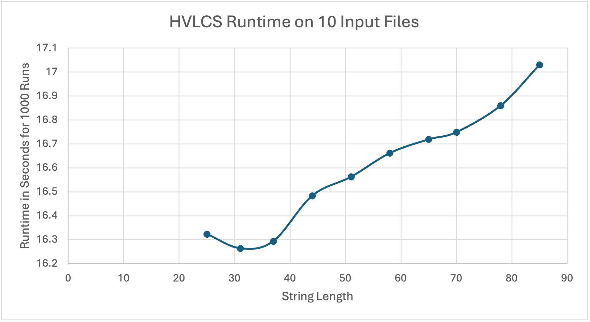

# COP4533 Assignment 3

Highest Value Longest Common Sequence

## Student
Name: Alexis Morales  
UFID: 20325573

## How to Run

Run the main program with:

    python3 src/hvlcs.py data/example.in

To test a file from the tests folder, run:

    python3 src/hvlcs.py tests/test1.in

To generate the runtime results file, run:

    python3 src/runtime_test.py

## Repository Structure

src/hvlcs.py  
Main solution for computing the highest value common subsequence.

src/runtime_test.py  
Runs the program on 10 test files and writes the timing results to a CSV file.

data/example.in  
Example input file.

data/example.out  
Expected output for the example input.

data/runtime_results.csv  
Measured runtime results.

data/runtime_graph.png  
Graph made from the runtime results.

tests/test1.in through tests/test10.in  
Input files used for the empirical runtime comparison.

## Example Input and Output

Example input:

    3
    a 2
    b 4
    c 5
    aacb
    caab

Expected output:

    9
    cb

## Assumptions

- The input follows the format given in the assignment.
- Every character in the strings appears in the alphabet list.
- Each character value is a nonnegative integer.
- If there is more than one optimal subsequence, the program may output any one of them.

## Question 1

For the empirical comparison, I created 10 nontrivial input files where each file contains two strings of length at least 25. I used the file runtime_test.py to run the main program 1000 times on each test file and store the total runtime in runtime_results.csv. I then used those results to make the runtime graph.

The graph shows a general increase in runtime as the input size becomes larger. There are some small fluctuations between points because timing results can vary slightly from run to run, but the overall trend is still upward. This makes sense because the program uses a dynamic programming table based on the lengths of the two input strings. As the strings become longer, the table becomes larger, so the runtime also increases.

## Question 2

Let dp[i][j] represent the maximum value of a common subsequence between the first i characters of A and the first j characters of B.

The base cases are:

- dp[0][j] = 0 for all j
- dp[i][0] = 0 for all i

These base cases are correct because if one of the strings is empty, then the only common subsequence is the empty subsequence, and its value is 0.

The recurrence is:

If A[i - 1] == B[j - 1], then

    dp[i][j] = max(dp[i - 1][j], dp[i][j - 1], dp[i - 1][j - 1] + value(A[i - 1]))

Otherwise,

    dp[i][j] = max(dp[i - 1][j], dp[i][j - 1])

This works because at each position there are only a few cases to consider. If the characters do not match, then they cannot both be used at that step, so the best answer must come from skipping one character from either A or B. If the characters do match, then there are three choices. We can skip the character from A, skip the character from B, or include the matching character and add its value to the best solution for the smaller prefixes. Taking the maximum of these cases gives the best answer for dp[i][j].

## Question 3

Pseudocode:

Read the alphabet values, string A, and string B

Let n be the length of A
Let m be the length of B

Create a 2D array dp

    For i from 0 to n
        dp[i][0] = 0

    For j from 0 to m
        dp[0][j] = 0

    For i from 1 to n
        For j from 1 to m
            If A[i - 1] == B[j - 1]
                take = dp[i - 1][j - 1] + value(A[i - 1])
                skipA = dp[i - 1][j]
                skipB = dp[i][j - 1]
                dp[i][j] = max(take, skipA, skipB)
            Else
                dp[i][j] = max(dp[i - 1][j], dp[i][j - 1])

    Return dp[n][m]

The runtime of this algorithm is O(nm) because the program fills one table entry for each pair of prefixes of the two strings, and each entry is computed in constant time.